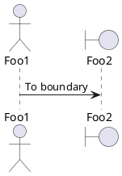
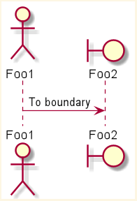
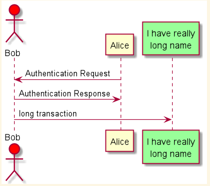
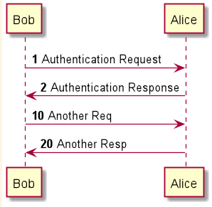

# PLANT UML 使用 


## 时序图 

### 一个简单实例
```
@startuml

用户 -> 认证中心 : 登录操作
认证中心 -> 缓存 : 存放(key, value) token

用户 <- 认证中心 : 认证成功返回token
用户 -> 认证中心 : 下次访问头部携带token

@enduml
```

### 声明参与者


可以使用以下关键字来声明参与者 

- participant 
- actor
- boundary 
- control 
- entity 
- database 
- collections 

**例子：**



**效果:**




关键字`as`可重命名参与者。可使用`RGB`值或者颜色名称(`red, green` 等) 修改参与者的背景颜色


**例子**

```
@startuml

actor Bob #red
participant Alice
participant "I have really\nlong name" as L #99ff99

Alice -> Bob : Authentication Request
Bob -> Alice : Authentication Response
Bob -> L : long transaction

@enduml
```
**效果** 





### 给自己发送信息 

参与者可以给自己发送信息，消息文字用\n来换行

**例子**
```
@startuml
Alice -> Alice : This is signal to self.\nIt also demonstrates\nmultiline \n next
@enduml
```

**效果**

略

### 对消息序列编号 

关键字 `autonumber` 用于自动对消息编号。 
语句 `autonumber //start//`  用于指定编号的初始值， 而 `autonumber //start// //increment//` 可以同时指定编号的初始值和每次增加的值 

**例子**

```
@startuml

autonumber
Bob -> Alice : Authentication Request
Bob <- Alice : Authentication Response

autonumber 10 10
Bob -> Alice : Another Req
Bob <- Alice : Another Resp

@enduml
```
 

**效果**




### 页面标题，页眉，页脚 

使用`title` 关键字增加标题 
使用`header` 关键字增加页眉 
使用 `footer` 关键字增加页脚 


**例子**

```
@startuml
header Page Header
footer Page %page% of %lastpage%

title Example Title
Alice -> Bob : message1
Alice -> Bob : message2 
@enduml 
```

**效果** 


### 分隔符 

使用 == 关键词可以将图表分割为多个步骤 

**例子** 

```
@startuml

== Initializtion ==

Alice -> Bob : Authentication Request
Bob -> Alice : Authentication Response

== Repetition ==
Alice -> Bob : Another authentication Request
Bob -> Alice : another authentication Response

@enduml
```

**效果** 


### 生命线的激活与撤销 


关键字 `activate` 和 `deactivate` 用来表示参与者的生命活动。
一旦参与者被激活，它的生命线就会显示出来。
`activate`和 `deactivate` 适用于以上情形
`destroy` 表示一个参与者的生命线的终结  


**例子**

```
@startuml

participant User

User -> A: DoWork
activate A

A -> B: << crateRequest >> 
activate B

B -> C: DoWork
activate C

C -> B: WorkDone 
destroy C

B --> A: RequestCreated 
deactivate B

A -> User: WorkDone
deactivate A  

@enduml
```

**效果**


使用嵌套的生命线 , 并且给生命线加颜色。

**例子**

```
@startuml
participant User

User -> A: DoWork
activate A #FFBBBB

A -> A: Internal call
activate A #DarkSalmon

A -> B: << createRequest >>
activate B

B --> A: RequestCreated
deactivate B
deactivate A
A -> User: Done
deactivate A

@enduml
```

**效果**


## 对象 


## 用例 


