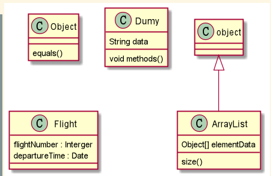

# Plant UML class Diagram 


## Declaring element 


**例子**
```
@startuml

abstract abstract
abstract class "abstract class"
annotation annotation
circle circle
() circle_short_form
class class
diamond diamond
<> diamond_short_form
entity entity
enum enum
interface interface

@enduml
```
**效果**


## Relationship between classes  

You can use the following symbols for relationship between classes  

| Type                  | Symbol        |
| --------------------- |:-------------:| 
| `Extension`(扩展)     | `<|--`        | 
| `Composition`(组合)   | `*--`         |  
| `Aggregation`(聚合)   | `o--`         |    


**例子**

```
@startuml

class01 <|-- class02
class03 *-- class04
class05 o-- class06
class07 .. class08
class09 -- class10 

@enduml
```

**效果** 


## Relationship identification 

在关系之间使用标签来说明时，使用`:`后接标签文字。 

对元素的说明，可以在每一边使用`""`来说明


**例子**

```
@startuml

Class01 "1" *-- "many" class02 : contains
class03 o-- class04: aggregation
class05 --> "1" class06


@enduml
```

**效果** 


## add method 


声明字段和方法，可以在类名:后，添加
也可使用 `{}` 把字段和方法括起来。 


**例子**

```
@startuml

object <|-- ArrayList

Object : equals()
ArrayList : Object[] elementData
ArrayList : size()

class Dumy {
String data
void methods()
}

class Flight {
    flightNumber : Interger 
    departureTime : Date
}
@enduml
```


**效果**

